# **Trading app - web pages**

 

### **Register**

This is the registration page where users can create their accounts.

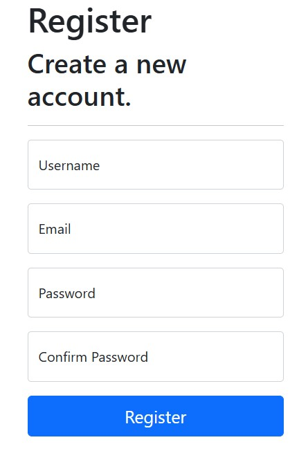

 

### **Login**

This is the page where users can log in with their accounts.

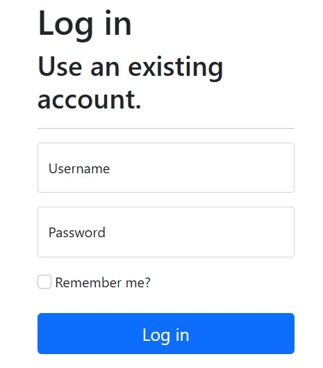

 

### **Products**

Shows all products which have state `approved` and also have at least one sell order. In order to lower the amount of data which goes from the DB to the client only a set number of products are shown. The user can navigate through the products by pressing the left and right arrow buttons on the bottom of the page. For each product the user can see the `front` image of the 3D model and also its name, price and creator Username. The user can buy the product and can also check its details before buying it. The app will not allow users to buy a product if their balance is below the product price nor if they already purchased the product. Creators are also not allowed to buy their own products. 

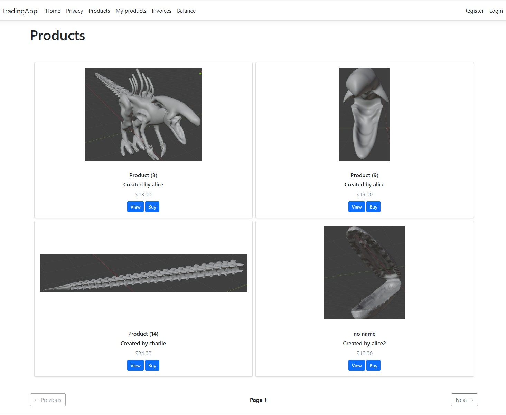

 

### **Product**

Shows additional information about the product such as the number of items in stock, a description and six images showing the 3D model captured from the 6 main sides - `front`, `back`, `top`, `bottom`, `left`, `right`. The page allows the user the buy the product.

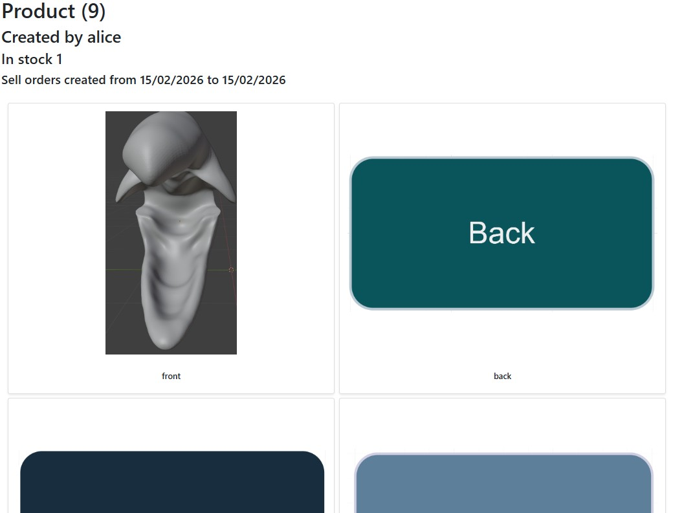
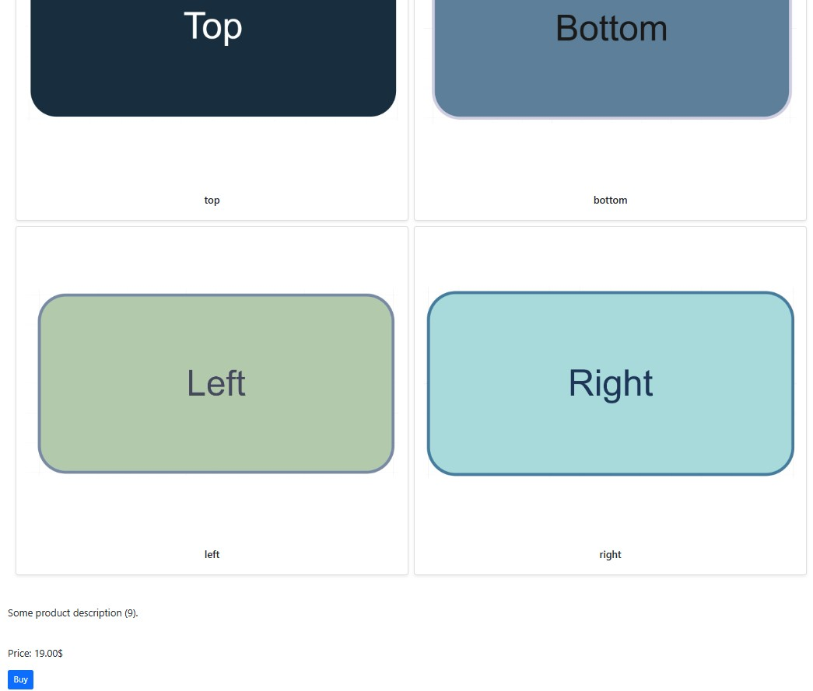

 

### **MyProducts**

Shows all products created by the currently logged user. This page looks a lot like the `Products` page however instead of providing a `buy` option it allows the user to edit and delete the selected product. The page also has a button `Create product` which allows the user to create a new product. Since the creator is always the currently logged user, for each product the page shows its status instead of the username of the creator. 

 

### **MyProduct**

Shows additional information about the product created by the currently logged user such as the number of active sale orders, the product description and six images of the 3D model. The user can edit and delete the product, and he can also create and cancel sell orders of the product. The app will not allow the user to create a sell order if the product's status is not `approved`. 

 

### **CreateProduct**

This page is a form which has 3 text fields and 7 file fields. In the text fields the user must provide information about the product's name, description and price. For the first 6 file fields the user should upload 6 images showing the 3D model from the 6 main sides (only the front side picture is required). For the last file field the user must provide the file containing the 3D model. The required fields are the text fields, the `front` image, the 3D model file. The app will not allow the user to create a product if he already created a product with the same name.

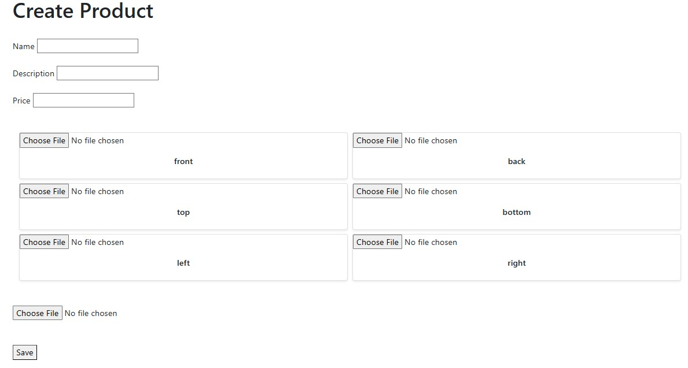

 

### **UpdateProduct**

This page looks a lot like `CreateProduct` however the purpose of this page is to edit an existing product rather than creating a new one. The text fields are automatically filled with the product's data. All file fields are optional and those for which the user provides a file will override the already existing one.  

 

### **Confirmation pages**

Those pages provide a description of what will happen if the user confirms. Confirmation pages have 2 buttons - one for cancellation and one for confirmation. The cancellation button redirects the user to the previous page. Even though all confirmation pages look the same, the action method of the `confirm` button is specific for each page. There are 4 confirmation pages:
* `BuySellOrder` - displays when a user tries to buy a product
* `CreateSellOrder` - displays when a user tries to create one or many sell orders of one of his products
* `CancelSellOrder` - displays when a user tries to cancel one or many sell orders of one of his products
* `DeleteProduct` - displays when a user tries to delete one of his products

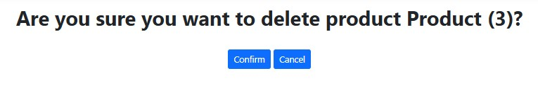

 

### **Message**

This page is used by other pages for showing messages of different type - error, success, hint, etc.

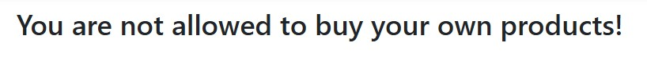

 

### **Invoices**

This page shows information about the successfully purchased or sold products. The data is displayed in a table which has 3 columns - `Title` which provides a small description of the order, `Completed At` which shows the date and time when the product was purchased/soled, `Details` contains a button which when pressed will show additional data for the order. The page will extract a set number of invoices from the DB. The invoices will be ordered in descending order by their completion date. The user can navigate through the invoices by pressing the left and right arrow buttons on the bottom of the page.

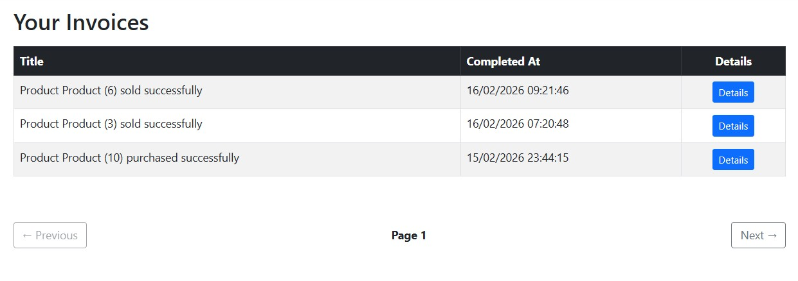

 

### **Invoice**

This page shows some additional information about the invoice such as the `front` image of the 3D model and the money which the user gained/spent for the product. If the product was purchased by the user the `Invoice` page will also show the seller's username and a `download` button which when pressed will download the 3D model file on the user's computer. The `download` button will not appear if the creator of the product deletes the product. 

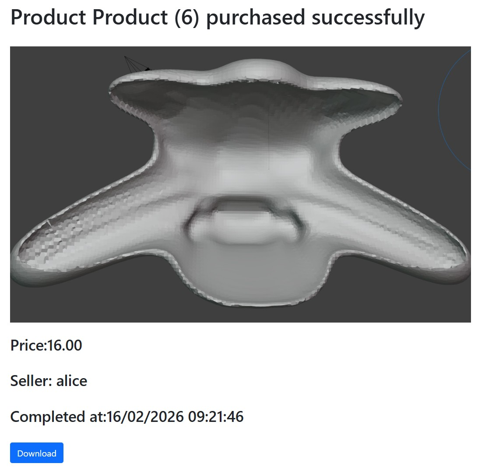

 

### **Balance**

This page is supposed to represent a money transfer from the user's bank account to the app's DB Balance table and vice versa. Since the application doesn't have bank accounting algorithm this page simply allows the user to increase or decrease his balance as much as he wants. The reason this page exists is because when a new user registers he will have no money in his balance which means he would not be able to buy products unless he manages to create and sell one or more products to get the money he needs to buy the desired one.  

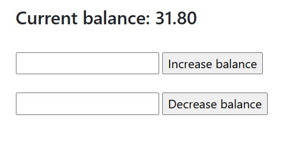
